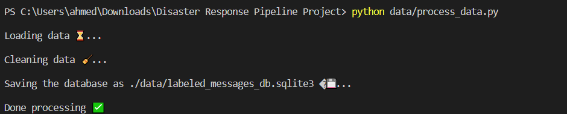

# Disaster Response Pipeline Project


## Description
The dataset contains pre-labeled tweets and messages from real-life disaster events. The project aim is to build a Natural Language Processing (NLP) model to categorize messages on a real-time basis for faster disaster response.

This project is divided into three main modules:
1. ETL pipeline: Load, Clean and Saves the data into an SQLite database.
2. NLP pipeline: Train a model on the cleaned data to classify messages in various categories.
3. web app: to serve the model with a user interface.


## Getting started
### Installing
To clone the git repository:
```git clone https://github.com/ahmedhussiien/Disaster-Response-NLP-Pipeline.git```


### Running the program
1. Run the pipelines to setup your dataset and model
    * To run the ETL pipeline that cleans and saves the data into a sqlite database use ```python data/process_data.py```
    * To run the the NLP pipeline that trains the model and saves it use ```python models/train_classifier.py```
    * Notice that both scripts can take arguments with new files, but running it without arguments it uses default values.

2. Run the app ```python app/run.py```
3. Go to http://127.0.0.1:5000/ or you can get the port that the flask app is running on from the terminal.


## Technologies used
* Flask
* Plotly
* Pandas
* Numpy
* Scikit-Learn
* SQLalchemy
* NLTK


## Project structure 
### File structure
```
- app
| - templates
| |- master.html 
| |- go.html  
|- run.py  # Flask file that runs app

- data
|- categories.csv
|- messages.csv
|- process_data.py
|- labeled_messages_db.sqlite3   # database containing the cleaned data

- models
|- train_classifier.py
|- classifier.pkl  # saved model

- notebooks
|- ETL Pipeline Preparation.ipynb # etl exploration
|- ML Pipeline Preparation.ipynb # ML exploration

- README.md
```

### System design
<p align="center">
  
</p>

    
## Screenshots
1. The main page


2. The results page


3. Sample run for process_data.py with default arguments




4. Sample run for train_classifier.py with default arguments


## Acknowledgements
* Udacity for providing the needed materials.
* [Figure Eight](https://www.figure-eight.com/dataset/combined-disaster-response-data/) for the dataset which is composed of:
    * categories.csv: Categories of the messages
    * messages.csv: disaster response messages
    

## Overview of the training dataset
As shown in the *Overview of Training Dataset* section on the main page the distribution of many classes is extremely skewed. The classifier in this project was not optimized very well to work in this case. In a real-world application I would increase the weight of recall in the score significantly to catch more of these low representation classes.
